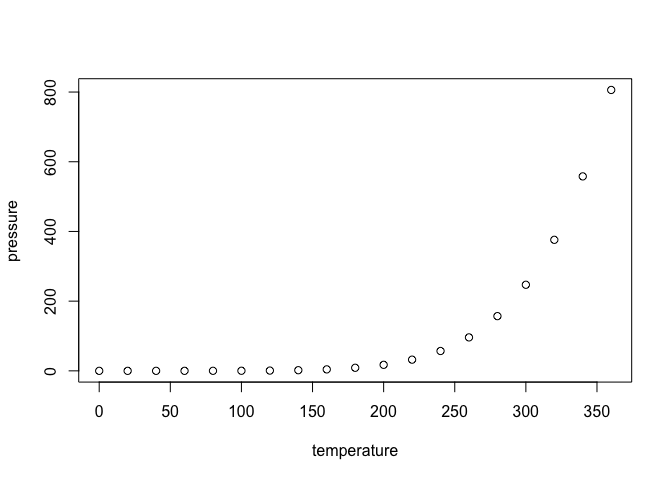

Moving window analysis of cell number density of lymph node images
================

## Introduction

This repository contains source codes of moving-window cell density
analysis presented in the paper

<title>

and examples of the analysis.

## Prerequisit

The actual analyses are done in R. However, core functions of obtaining
3D geometric intersections and volumes were imported from the geometric
libraries, libigl and CGAL written in c++ through the Rcpp package.
Thus, users are required to install libigl (<https://libigl.github.io>)
and CGAL (<https://doc.cgal.org/latest/Manual/usage.html>).
Additionally, Eigen
(<https://eigen.tuxfamily.org/dox/GettingStarted.html>), Boost
(<https://www.boost.org/>), GMP (<https://gmplib.org/>) and MPFR
(<https://www.mpfr.org/>) are required to run libigl and CGAL libraries.

## How to use

Download and copy the files functions.R, mesh\_boolean\_R.cpp, and
mesh\_volume\_R.cpp to a folder where you perform your analysis.

## Including Plots

You can also embed plots, for example:

<!-- -->

Note that the `echo = FALSE` parameter was added to the code chunk to
prevent printing of the R code that generated the plot.
